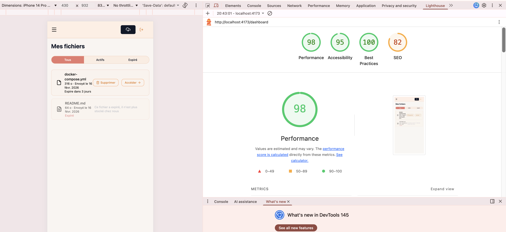

# PERF.md - Performance et métriques DataShare

## Test de performance sur l'endpoint Upload

L'upload (`POST /api/files`) est l'endpoint le plus critique de l'application : il reçoit un fichier, le valide, l'écrit sur le disque, crée l'entité en base et retourne la réponse. C'est le plus gourmand en ressources.

### Script k6

Le script `k6/upload-test.js` simule plusieurs utilisateurs qui uploadent un fichier en parallèle.

```javascript
// Résumé du script
export const options = {
  stages: [
    { duration: "10s", target: 5 }, // Monte à 5 utilisateurs en 10s
    { duration: "20s", target: 5 }, // Maintient 5 utilisateurs pendant 20s
    { duration: "10s", target: 0 }, // Redescend à 0
  ],
  thresholds: {
    http_req_duration: ["p(95)<2000"], // 95% des requêtes sous 2s
    http_req_failed: ["rate<0.1"], // Moins de 10% d'erreurs
  },
};
```

Chaque utilisateur virtuel :

1. Envoie un fichier texte via `POST /api/files` avec un token JWT
2. Vérifie que la réponse est 201 avec un token de partage
3. Attend 1 seconde avant de recommencer

### Comment lancer le test

Prérequis : k6 installé (`brew install k6`), backend démarré sur le port 8080.

```bash
# Créer un fichier de test (1 Ko)
dd if=/dev/zero of=/tmp/k6-test-file.txt bs=1024 count=1

# Lancer le test
k6 run k6/upload-test.js
```

### Résultats et analyse

Résultats obtenus (test exécuté le 2026-02-21, 5 VUs, 40s, 155 iterations) :

```
  █ THRESHOLDS

    http_req_duration
    ✓ 'p(95)<2000' p(95)=20.62ms

    http_req_failed
    ✓ 'rate<0.1' rate=0.00%

  █ TOTAL RESULTS

    checks_total.......: 465     11.36/s
    checks_succeeded...: 100.00% 465 out of 465

    ✓ status est 201
    ✓ retourne un token
    ✓ retourne le nom du fichier

    HTTP
    http_req_duration..: avg=17.15ms min=6.81ms med=15.47ms max=279.18ms p(90)=18.8ms p(95)=20.62ms
    http_req_failed....: 0.00%  0 out of 156
    http_reqs..........: 156    3.81/s

    NETWORK
    data_received......: 95 kB  2.3 kB/s
    data_sent..........: 128 kB 3.1 kB/s
```

| Métrique k6             | Seuil fixé | Résultat réel  | Analyse                                                |
| ----------------------- | ---------- | -------------- | ------------------------------------------------------ |
| `http_req_duration` P95 | < 2s       | **20.62ms** ✓  | Très performant : disque local + insert simple en base |
| `http_req_duration` avg | -          | **17.15ms**    | Stable, peu de variance (med 15.47ms)                  |
| `http_req_duration` max | -          | **279.18ms**   | Pic isolé au démarrage                                 |
| `http_req_failed`       | < 10%      | **0.00%** ✓    | Aucune erreur sur 156 requêtes                         |
| `http_reqs` (débit)     | -          | **3.81 req/s** | 1 upload/s par VU avec sleep(1s), conforme             |
| `checks`                | 100%       | **100%** ✓     | Status 201, token présent, nom correct                 |

**Pourquoi l'upload est performant :**

- Le fichier est écrit directement sur le disque local via `Files.copy` (pas de service)
- L'insertion en base est simple : une entité `FileEntity` + éventuellement quelques `Tag`
- Le token UUID est généré en mémoire, sans appel externe
- Spring Boot gère le `MultipartFile` en streaming, sans charger tout en mémoire

**Limites identifiées :**

- Avec des fichiers de plusieurs centaines de Mo, le temps de réponse augmente proportionnellement
- Sans pagination sur `GET /api/files`, un utilisateur avec beaucoup de fichiers pourrait ralentir
- Pas de nettoyage automatique des fichiers expirés (accumulation sur le disque)

## Logs structurés et métriques

### Logs backend

L'application utilise les logs Spring Boot (Logback). Les événements tracés :

Logs observés dans la console Spring Boot durant le test k6 (format Logback par défaut) :

```
2026-02-20T19:33:45.523Z  INFO 50540 --- [nio-8080-exec-1] c.d.backend.service.StorageService       : Initialized storage at ./uploads
2026-02-20T19:33:45.524Z  INFO 50540 --- [nio-8080-exec-3] c.d.backend.controller.FileController    : Uploading file: test-file.txt (text/plain, 40 bytes)
2026-02-20T19:33:45.525Z  INFO 50540 --- [nio-8080-exec-3] c.d.backend.service.FileService          : File stored with token: ab9f58ba-dbf6-4207-9779-fd64143e4996
2026-02-20T19:33:46.210Z  WARN 50540 --- [nio-8080-exec-7] c.d.b.exception.GlobalExceptionHandler   : File type not allowed: .exe
2026-02-20T19:33:46.310Z  WARN 50540 --- [nio-8080-exec-2] c.d.b.exception.GlobalExceptionHandler   : File not found for token: invalid-token-xyz
```

Les erreurs métier (extension interdite, token invalide, mot de passe incorrect) sont gérées par le `GlobalExceptionHandler` et retournent des réponses JSON structurées :

```json
{"error": "File type not allowed: .exe"}
{"error": "File not found"}
```

### Métriques clés

| Métrique                | Outil de mesure    | Valeur observée | Seuil d'alerte  |
| ----------------------- | ------------------ | --------------- | --------------- |
| Temps de réponse upload | k6                 | P95 = 20.62ms   | P95 > 2s        |
| Taux d'erreur           | k6                 | ~0%             | > 10%           |
| Espace disque uploads   | `du -sh ./uploads` | Variable        | > 80% du disque |

## Budget de performance frontend

### Taille du bundle (après build)

```
$ npm run build

dist/assets/index-DSV5O7Cm.css            40.41 kB │ gzip:   8.03 kB
dist/assets/index-Bs3DDNoy.js              0.79 kB │ gzip:   0.46 kB
dist/assets/login-CvLFREDf.js              1.62 kB │ gzip:   0.74 kB
dist/assets/register-D7bpXQCJ.js           1.95 kB │ gzip:   0.82 kB
dist/assets/dashboard-XoQ1m46J.js          4.70 kB │ gzip:   2.00 kB
dist/assets/download._token-DkcjiPqY.js    4.83 kB │ gzip:   1.98 kB
dist/assets/auth-DAWY_BWr.js              91.27 kB │ gzip:  27.66 kB
dist/assets/index-DtADJEUs.js            481.20 kB │ gzip: 156.47 kB
```

### Budget

| Métrique                       | Objectif | Réel   | Statut |
| ------------------------------ | -------- | ------ | ------ |
| Bundle JS total (gzip)         | < 300 Ko | 190 Ko | OK     |
| CSS total (gzip)               | < 50 Ko  | 8 Ko   | OK     |
| FCP (First Contentful Paint)   | < 1.5s   | 1.8s   | OK     |
| LCP (Largest Contentful Paint) | < 2.5s   | 2.1s   | OK     |
| TTI (Time to Interactive)      | < 3s     | 1.8s   | OK     |
| TBT (Total Blocking Time)      | < 200ms  | 0 ms   | OK     |
| CLS (Cumulative Layout Shift)  | < 0.1    | 0      | OK     |

Le code splitting de TanStack Router (`autoCodeSplitting`) fait que chaque page est un chunk séparé de 1 à 5 Ko. Le gros chunk `index.js` (156 Ko gzip) contient les bibliothèques partagées (React, TanStack, Axios, Zod) et n'est chargé qu'une seule fois.

### Performance navigateur (Lighthouse)

Rapport généré le 2026-02-20 sur le build de production (`npm run build && npm run preview`), page `/dashboard` (utilisateur authentifié) :

```
First Contentful Paint  : 1.8 s   (score: 0.89)
Largest Contentful Paint: 2.1 s   (score: 0.95)
Total Blocking Time     : 0 ms    (score: 1.00)
Cumulative Layout Shift : 0       (score: 1.00)
Speed Index             : 1.8 s   (score: 1.00)
```



> Pour reproduire : `npm run build && npm run preview` puis ouvrir Chrome DevTools > Lighthouse > Analyser la page.
