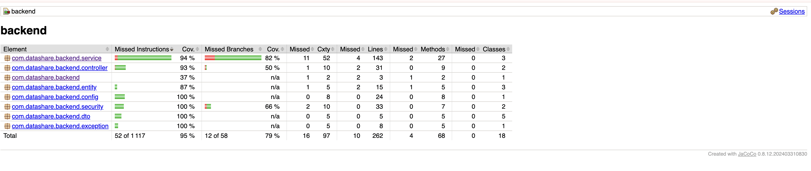

# TESTING.md - Plan de tests DataShare

## Vue d'ensemble

L'application DataShare est testée à trois niveaux :

- **Backend** (Spring Boot 4) : tests unitaires avec Mockito + tests d'intégration avec H2 et MockMvc
- **Frontend** (React 19) : tests unitaires avec Vitest et Testing Library
- **End-to-end** : tests Cypress couvrant les parcours critiques (inscription, upload, téléchargement)

## Plan de tests

| Fonctionnalité         | Type de test                 | Critère d'acceptation                                                                                   |
| ---------------------- | ---------------------------- | ------------------------------------------------------------------------------------------------------- |
| Inscription            | Unitaire + Intégration + E2E | Un utilisateur peut créer un compte, un email en double est rejeté, redirection vers dashboard          |
| Connexion              | Unitaire + Intégration + E2E | Un utilisateur peut se connecter, les mauvais identifiants affichent une erreur                         |
| Upload de fichier      | Unitaire + Intégration + E2E | Un fichier est uploadé et stocké, les extensions interdites sont rejetées, le lien de partage s'affiche |
| Téléchargement         | Unitaire + Intégration + E2E | Un fichier peut être téléchargé via son token, le mot de passe est vérifié                              |
| Historique fichiers    | Unitaire + Intégration + E2E | L'utilisateur voit ses fichiers après upload                                                            |
| Suppression            | Unitaire + Intégration       | Seul le propriétaire peut supprimer son fichier                                                         |
| Token JWT              | Unitaire                     | Le token est généré, l'email est extrait, un token invalide est rejeté                                  |
| Stockage fichiers      | Unitaire                     | Les fichiers sont stockés, chargés et supprimés correctement                                            |
| Validation schémas     | Unitaire (front)             | Les schémas Zod valident email, mot de passe, confirmation                                              |
| Authentification front | Unitaire (front)             | Le hook useAuth détecte le token, gère le logout                                                        |
| Intercepteur Axios     | Unitaire (front)             | Le header Authorization est ajouté quand un token existe                                                |

## Commandes

### Backend

```bash
cd backend

# Lancer les tests
mvn test -Dspring.profiles.active=test

# Générer le rapport de couverture (JaCoCo)
mvn test jacoco:report -Dspring.profiles.active=test
```

### Frontend - Tests unitaires

```bash
cd frontend

# Lancer les tests
npm test

# Lancer les tests avec couverture
npm run test:coverage
```

### Frontend - Tests E2E (Cypress)

Prérequis : le backend (port 8080) et le frontend (port 5173) doivent tourner.

```bash
cd frontend

# Lancer en mode headless (CI)
npm run cypress:run
```

## Structure des tests

### Backend (60 tests)

```
src/test/java/com/datashare/backend/
  service/
    AuthServiceTest.java            (5 tests)  - register, login, erreurs
    FileServiceTest.java            (26 tests) - upload, download, delete, validations
    StorageServiceTest.java         (4 tests)  - store, load, delete
  security/
    JwtUtilTest.java                (5 tests)  - génération, extraction, validation
  exception/
    GlobalExceptionHandlerTest.java (2 tests)  - gestion des erreurs
  controller/
    AuthControllerIntegrationTest.java  (7 tests)  - endpoints auth complets
    FileControllerIntegrationTest.java  (10 tests) - endpoints fichiers complets
```

### Frontend - Unitaires (13 tests)

```
src/
  schemas/__tests__/auth.test.ts     (6 tests)  - validation Zod
  hooks/__tests__/useAuth.test.ts    (4 tests)  - hook authentification
  api/__tests__/axios.test.ts        (3 tests)  - intercepteur JWT
```

### Frontend - E2E Cypress (3 fichiers)

```
cypress/e2e/
  auth.cy.ts              - Inscription, connexion, mauvais mot de passe
  upload-download.cy.ts   - Upload d'un fichier, vérification dans l'historique
  download-page.cy.ts     - Page de téléchargement, token invalide
```

## Rapport de couverture

### Backend (JaCoCo) - Seuil atteint : 95%+

| Métrique     | Couverture | Seuil |
| ------------ | ---------- | ----- |
| Instructions | 95.3%      | 70%   |
| Branches     | 79.3%      | 70%   |
| Lignes       | 96.2%      | 70%   |
| Méthodes     | 94.1%      | 70%   |
| Classes      | 100%       | 70%   |

```bash
cd backend
mvn test jacoco:report -Dspring.profiles.active=test
```



### Frontend - Seuil atteint : 94%+

| Métrique   | Couverture | Seuil |
| ---------- | ---------- | ----- |
| Statements | 94.73%     | 70%   |
| Branches   | 100%       | 70%   |
| Functions  | 87.5%      | 70%   |
| Lines      | 100%       | 70%   |


## Profil de test

Les tests d'intégration backend utilisent le profil `test` avec :

- Base de données H2 en mémoire (pas de PostgreSQL nécessaire)
- Répertoire de stockage temporaire (`./test-uploads`)
- Secret JWT de test
- Schéma auto-généré (`create-drop`)
